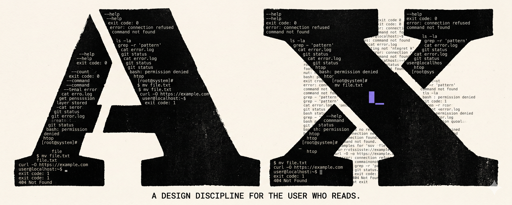

# People, Agents and Culture

A small collection of writing about working with agents — how to design for them, how to hire for them, how the culture of building software shifts when the user reading your interface isn't human.

This repo is meant to be **forked**. The documents here are drafts in public. Strip what doesn't apply, sharpen what does, attribute the original, and send a link to what you ship. Public collaboration is the point.

## Documents

- **[AX Designer](AX-DESIGNER.md)** — A draft job description for a role that doesn't exist yet but will. The case for *Agent Experience* as a discipline parallel to UX and DX, sixteen principles, and a job description teams can fork.

## How to fork

Click **Fork** in GitHub's top-right, edit in your copy, attribute back. Or just clone:

```bash
git clone https://github.com/emre-t808/people-agents-and-culture.git
```

Open a PR if you want to upstream a change. Open an issue if you want to discuss before writing.

## License

Documents in this repo are licensed under [Creative Commons Attribution 4.0 International (CC BY 4.0)](LICENSE). You can copy, remix, and redistribute commercially — just credit the original.
